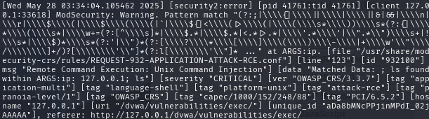

# WAF Simulation Project (ModSecurity + OWASP CRS + DVWA)

This project demonstrates how to set up a local Web Application Firewall using ModSecurity and the OWASP Core Rule Set (CRS) on Kali Linux, paired with Damn Vulnerable Web Application (DVWA). The simulation captures and logs common web attacks and rule triggers for security analysis.

---

## Tools & Technologies

- **ModSecurity v3**
- **OWASP Core Rule Set (CRS)**
- **Apache2 Web Server**
- **DVWA (Damn Vulnerable Web Application)**
- **Kali Linux**
- **Logs (modsec_audit.log / apache2 error.log)**

---

### Lab Setup & Steps

### Step 1: Install Apache & ModSecurity

```sudo apt install apache2 libapache2-mod-security2 -y```


---

### Step 2: Enable ModSecurity and Verify

```sudo a2enmod security2```

Then edit /etc/modsecurity/modsecurity.conf and turn SecRuleEngine on


---

### Step 3: Link OWASP CRS

Edit /etc/apache2/mods-enabled/security2.conf to include OWASP CRS rules
(Include optional lines are included OWASP CRS rules)


### Step 4: Scan for errors

```sudo apachectl configtest```

If you receive errors like duplicate rule id, you may get a lot of them, go through each one and comment the lines where you get them

---

### Step 5: Set Up DVWA

```cd /var/www/html
sudo git clone https://github.com/digininja/DVWA.git
cd DVWA
sudo cp config/config.inc.php.dist config/config.inc.php
```
Configure DVWA settings to requirements


---

### Step 6: Start Apache and Access DVWA

```sudo systemctl restart apache2```

Go to http://127.0.0.1/DVWA and log in.


---

### Step 7: Create Database and Adjust Security Level


---

### Step 8: Run Attacks on DVWA

Running XSS, SQLI, and Command Injection attacks on DVWA


---
### Step 9: Check Modsecurity Logs For Alerts

Modsecurity successfully detected malicious traffic into DVWA, WAF working as intended

Modsecurity detects Command Injection being inputed


Modsecurity detects XSS being inputed


Modsecurity detects SQLI being inputed


---

Takeaways From Project

ModSecurity + CRS can detect a wide range of web attacks.

Custom tuning is required in order to prevent false positives.

Logs help verify attack attempts.

---

Future Add-ons
Add ELK or Splunk for log visualization

Write custom ModSecurity rules


